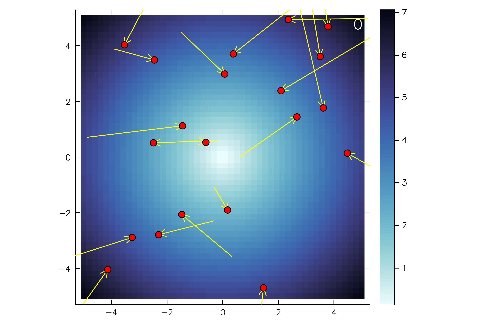

# ParticleSwarmOptimizer.jl

The ParticleSwarmOptimizer (PSO) is an optimization algorithm based on the idea of bird flocking or fish schooling. The PSO can also be used for nonlinear and noncontinous functions.

